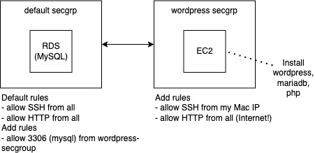

# Learn AWS
> Documenting the learning path

## Wordpress hosting
### 1. Deploy Wordpress with Lightsail
Simplest form.

https://lightsail.aws.amazon.com/ls/docs/en_us/articles/amazon-lightsail-tutorial-launching-and-configuring-wordpress

### 2. Deploy Wordpress with EC2 and RDS

Create a managed MySQL via RDS and create a EC2. Install httpd, wordpress, mariadb and php. Tweak security groups for access.

https://aws.amazon.com/tutorials/deploy-wordpress-with-amazon-rds/

## 2. Host a static website via GCP
Static website contain client-side technologies such as HTML, CSS, and JavaScript. It does not contain server-side scripts like PHP.
Prereq: Own a domain such as jiwonhu.com, using GCP Cloud DNS. Prepare simple files index.html and 404.html as regular webpage and error page.
### 1. via HTTP
Create a bucket with name www.jiwonhu.com and configure a CNAME record in GCP DNS.
https://cloud.google.com/storage/docs/hosting-static-website-http#create-bucket

### 2. via HTTPS with LB and certificate
Create a bucket with any name. Create a LB with a google-managed certificate. Configure A record of www.example.com and wait for 24 hours for certificate to be provisioned.
https://cloud.google.com/storage/docs/hosting-static-website#recommended_monitor_the_ssl_certificate_status
